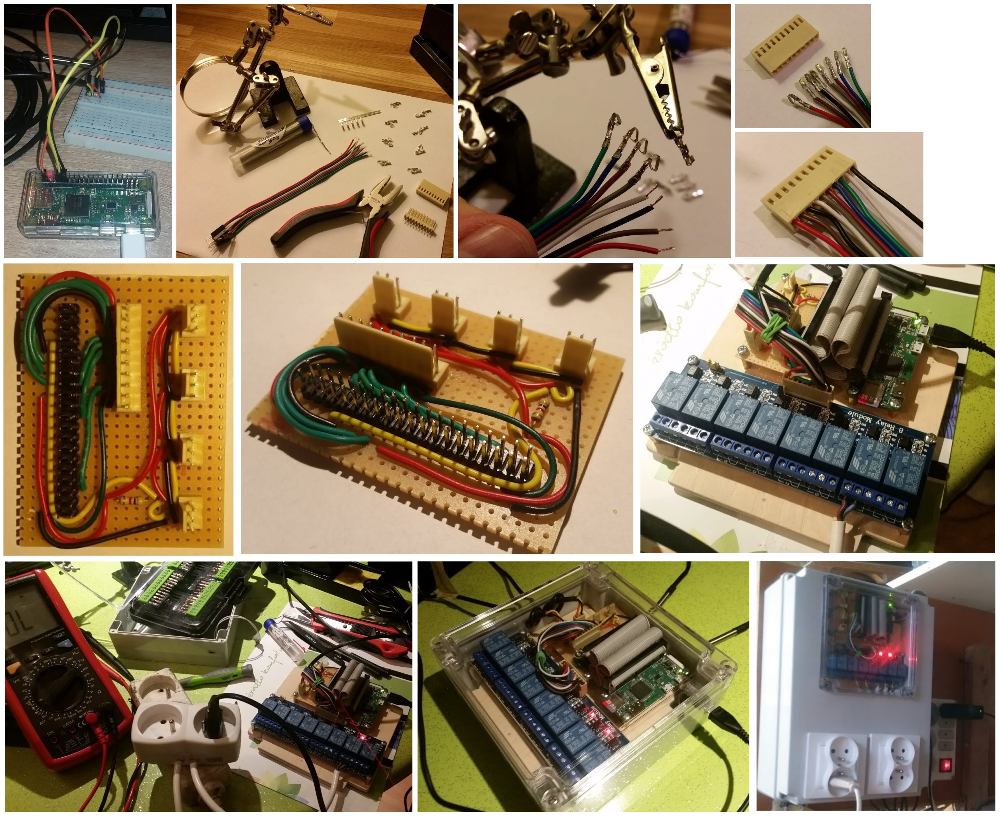

# README #

### What is this repository for? ###

This project implements temperature controller and can be run on Raspberry Pi. 
It was created for a home brewery owned by my father. 
It supports multiple thermal sensors using 1-wire interface and is able to control attached relays activating heating or cooling to maintain desired temperature. 

All the documentation, including assembly schemes, can be found in the [docs](docs) folder. 

The final controller was built using commonly available electronic parts. Refer to this pic to see consecutive development stages up until deployment in the real brewery.




### How do I get set up? ###

The app communicates with therm sensors via 1-wire interface. 
By default 1-wire support is disabled on Raspberry-Pi. The library
used for communication with therm sensors attempts to load kernel
module for 1-wire support at every start but preferred way is to
load this module manually and disable auto loading by setting
environment variable W1THERMSENSOR_NO_KERNEL_MODULE=1
In order manually add proper kernel module to enable 1-wire support
do the following on Raspberry-Pi device:
- sudo raspi-config
- Select 'Interfacing Options'
- Select 'P7 1-Wire'
- Select 'Yes' to enable 1-wire interface
- When leaving raspi-config remember to reboot the device
- After boot type lsmod and verify whether w1_gpio module is correctly loaded  

### Configuration ####

Depending on used relay type it is possible to control them with low or high voltage. See RelayApi class. 

#### Dependencies ####

The app is intended to run on Python 3.5

The code requires the dependencies defined in requirements.txt file to be installed. In order to do this type 

```  
pip install -r requirements.txt
pip3 install -r requirements.txt
```

#### How to run tests ####
In order to run unit tests type the following command in the root directory

```
pip3 install -r requirements.txt
export W1THERMSENSOR_NO_KERNEL_MODULE=1
python3 -m unittest discover -s tests
```

In order to run the tests from IDE like PyCharm you may need to specify
the W1THERMSENSOR_NO_KERNEL_MODULE variable in Run Configuration

#### Deployment instructions ####
On your raspberry-pi clone this project and run with

```
pip3 install -r requirements.txt
python3 -m app.main
```

There is also an option to run on PC by specifying additional system variable.
In this case all hardware components (therm sensors, relays) are simulated by mocks.

```
export RUN_ON_RASPBERRY=0
python3 -m app.main
```

Enable autostart on RPi boot

```
#on Raspberry
sudo cp brewery.service /lib/systemd/system
sudo chmod 644 /lib/systemd/system/brewery.service
sudo systemctl daemon-reload
sudo systemctl enable brewery.service
sudo reboot
#check status
sudo systemctl status brewery.service
```

The server can be run in Docker container in mock mode (RUN_ON_RASPBERRY=0).
This is the easiest option of deployment as it doesn't require any manual
dependencies installation. Use attached Dockerfile to create a Docker image 
by executing the following command.

```
docker build -t raspberry-pi-brewery-controller .
```

After image is assembled you can run the server 

```
docker container run --detach --publish=8080:8080 raspberry-pi-brewery-controller
```

### Used libraries ###
* https://github.com/timofurrer/w1thermsensor
* https://sourceforge.net/p/raspberry-gpio-python/wiki/
* https://github.com/willbuckner/rpi-gpio-development-mock


### Who do I talk to? ###

* Piotr Marcinkowski - piotrmarc@gmail.com (developer)
* Stanisław Marcinkowski - stanislawm@o2.pl (master brewer)

